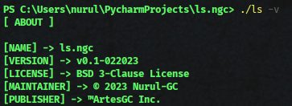

# ls.ngc

> this is an enhaced copy of the `ls` command on Unix terminals, made for windows'users.

## Demonstration

`run 'ls' command:` \

`run 'ls -v' command:` \

`run 'ls -h' command:` \

---

&copy; 2023 Nurul-GC | [BSD 3-Clause License](LICENSE.txt) | &trade;ArtesGC Inc.

